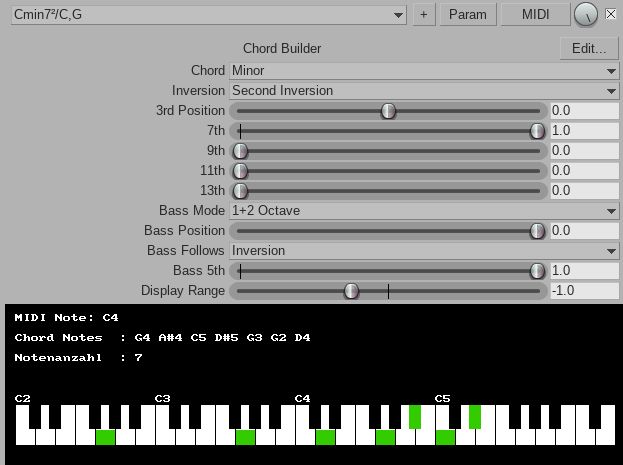

Reaper JSFX Plugin for building MIDI chords

- Copy the file to /home/your_name/.config/REAPER/Effects/Klangraum/ or a similar drawer on Windows/Mac
- Rescan plugins
- Example: https://soundcloud.com/klangraum2/impossible-dream-2
- Experimental VST (64Bit) chord_builder.dll
  
Note: Alpha release. Not all functions are implemented yet. Some Combos, Sliders have no effect.

JSFX Programming: http://reaper.fm/sdk/js/js.php#js_intro
